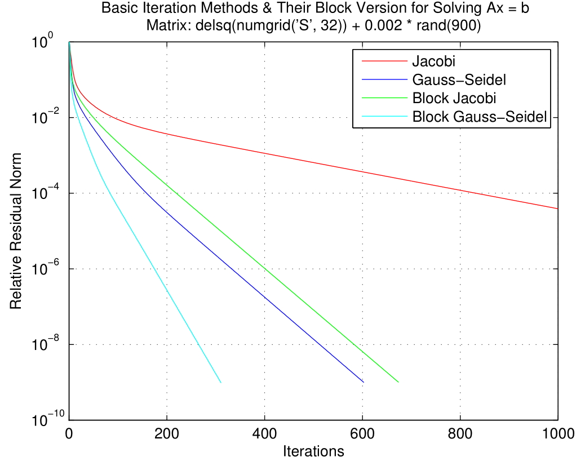

## Jacobi Iteration, Gauss-Seidel Iteration and Their Block Version

For Jacobi and Gauss-Seidel Iteration:

`[x, converged, iter_cnt, res_norm] = {Jacobi, GS}_Iter(A, b, res_tol, max_iter)`

Solve $x$ for $Ax=b$ s.t. $\|b-Ax\|_2 \le \|b\|_2 \cdot res\_tol$ with at most $max\_iter$ iterations. `converged` marks whether the solver converged to given tolerance within given maximum iterations. `iter_cnt` is the number of iterations the solver has executed. `res_norm` is a vector that contains the residual norm of each iteration. Default value for `res_tol` is $1e-9$.

For block version:

`[x, converged, iter_cnt, res_norm] = Block_{Jacobi, GS}_Iter(A, b, block_spos, res_tol, max_iter)`

`block_spos` is an array of length $k+1$ if you want to partition $A$ into $k \times k$ blocks. The row & column range of diagonal block $A_{i,i}$ is `block_spos(i) : block_spos(i+1)-1`.

`testBasicIterMethods.m` is a test script for testing all these methods. Here is the result of `testBasicIterMethods(32)`:

